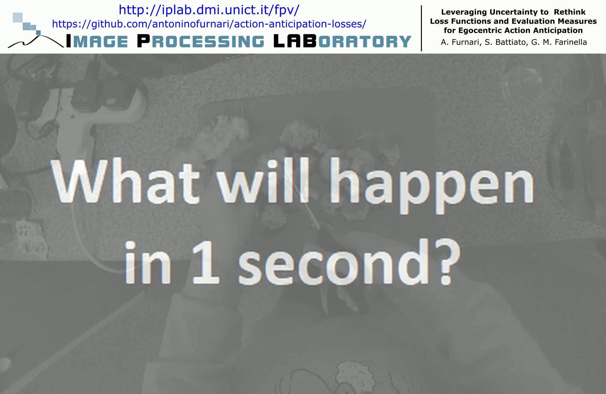

# Video Demo
[](https://www.youtube.com/watch?v=w_3FiIcnUlc)

# PyTorch Action Anticipation Losses
This repository implements the Verb-Noun Marginal Cross Entropy Loss (VNMCE) proposed in the paper ([download here](http://www.antoninofurnari.it/publications/furnari2018Leveraging.pdf)):

`A. Furnari, S. Battiato, G. M. Farinella (2018). Leveraging Uncertainty to Rethink Loss Functions and Evaluation Measures for Egocentric Action Anticipation . In International Workshop on Egocentric Perception, Interaction and Computing (EPIC) in conjunction with ECCV.`

We also report an implementation of the Truncated Top-5 Entropy Loss proposed in the paper:

`Lapin, Maksim, Matthias Hein, and Bernt Schiele. "Loss functions for top-k error: Analysis and insights." Proceedings of the IEEE Conference on Computer Vision and Pattern Recognition. 2016.`

Please see the code for usage examples.

## Results on the EPIC-KITCHENS test sets
At the time of the publication, the evaluation server for the egocentric action recognition/anticipation challenges was not available. Therefore the results of the proposed method are not reported in the paper. To allow for fair comparisons with other methods, the results on the test sets are reported in the following.

### Action Anticipation
These results are related to the TSN model trained for the task of egocentric action anticipation with the VNMCE loss (please refer to the [paper](http://www.antoninofurnari.it/publications/furnari2018Leveraging.pdf) for more details):

<table>
<tr>
	<th></th><th colspan=3>Top-1 Accuracy (%)</th><th colspan=3>Top-5 Accuracy (%)</th><th colspan=3>Precision (%)</th><th colspan=3>Recall (%)</th>
</tr>
<tr>
<th>Set</th>
  <th>V</th><th>N</th><th>A</th><th>V</th><th>N</th><th>A</th><th>V</th><th>N</th><th>A</th><th>V</th><th>N</th><th>A</th>
<tr>
<td>Seen</td><td>27.92</td><td>16.09</td><td>10.76</td><td>73.59</td><td>39.32</td><td>25.28</td><td>23.43</td><td>17.53</td><td>6.05</td><td>14.79</td><td>11.65</td><td>5.11</td></tr>
  <tr>
<td>Unseen</td><td>21.27</td><td>9.90</td><td>5.57</td><td>63.33</td><td>25.50</td><td>15.71</td><td>10.02</td><td>6.88</td><td>1.99</td><td>7.68</td><td>6.61</td><td>2.39</td>
</tr>
</table>

### Action Recognition
These results are related to the TSN model trained for the task of egocentric action recognition with the VNMCE loss (please refer to the [paper](http://www.antoninofurnari.it/publications/furnari2018Leveraging.pdf) for more details):

<table>
<tr>
  <th></th><th colspan=3>Top-1 Accuracy (%)</th><th colspan=3>Top-5 Accuracy (%)</th><th colspan=3>Precision (%)</th><th colspan=3>Recall (%)</th>
</tr>
<tr>
<th>Set</th>
  <th>V</th><th>N</th><th>A</th><th>V</th><th>N</th><th>A</th><th>V</th><th>N</th><th>A</th><th>V</th><th>N</th><th>A</th>
<tr>
<td>Seen</td><td>54.22</td><td>38.85</td><td>29.00</td><td>85.22</td><td>61.80</td><td>49.62</td><td>53.87</td><td>38.18</td><td>18.22</td><td>35.88</td><td>32.27</td><td>16.56</td>
<tr>
<td>Unseen</td><td>40.90</td><td>23.46</td><td>16.39</td><td>72.11</td><td>43.05</td><td>31.34</td><td>26.62</td><td>16.83</td><td>7.10</td><td>15.56</td><td>17.70</td><td>10.17</td>
</tr>
</table>


## Publication

Please reference this publication if you find this code useful:

```
@inproceedings{furnari2018Leveraging,
  author = { A. Furnari and S. Battiato and G. M. Farinella },
  title = {  Leveraging Uncertainty to Rethink Loss Functions and Evaluation Measures for Egocentric Action Anticipation  },
  booktitle = {  International Workshop on Egocentric Perception, Interaction and Computing (EPIC) in conjunction with ECCV  },
  year = { 2018 },
}
```
## Related Works
You can find related works at the following page: [http://iplab.dmi.unict.it/fpv/](http://iplab.dmi.unict.it/fpv/).
